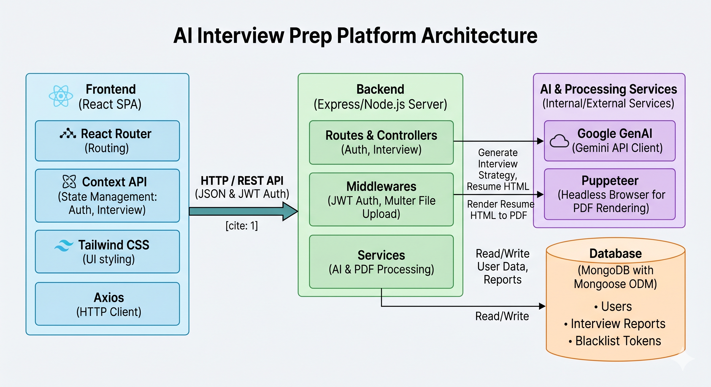

# 🚀 AI Interview Prep Platform

An AI-powered interview preparation platform that analyzes resumes, job descriptions, and candidate profiles to generate a personalized interview strategy.
Built with a modern MERN-style architecture using React, Node.js, MongoDB, and Google Gemini AI. ✨


---

# 📸 Project Architecture



You can create an `assets` folder in the root directory and upload images like:

```bash
assets/
 ├── banner.png
 ├── home-page.png
 └── interview-report.png
```

---

# 🌟 Features

* 🔐 Authentication System (Register/Login/Logout)
* 🍪 JWT Authentication with HTTP-only Cookies
* 📄 Resume Upload Support (PDF)
* 🤖 AI-Powered Interview Report Generation
* 🧠 Technical & Behavioral Interview Questions
* 📊 Match Score Analysis
* 🛠️ Skill Gap Detection
* 📅 Personalized Preparation Roadmap
* 📥 AI Resume PDF Generator
* 📚 Interview History Dashboard
* 🎨 Modern Dark UI with Tailwind CSS
* ⚡ Fast Frontend with Vite + React 19

---

# 🏗️ Tech Stack

## Frontend

* React.js
* React Router
* Tailwind CSS
* Axios
* Vite

## Backend

* Node.js
* Express.js
* MongoDB
* Mongoose
* JWT Authentication
* Multer
* Puppeteer

## AI & Utilities

* Google Gemini AI
* Zod
* pdf-parse

---

# 📂 Project Structure

```bash
AI-Interview-Prep/
│
├── Backend/
│   ├── src/
│   │   ├── controllers/
│   │   ├── middlewares/
│   │   ├── models/
│   │   ├── routes/
│   │   ├── services/
│   │   └── config/
│   │
│   └── server.js
│
├── Frontend/
│   ├── src/
│   │   ├── components/
│   │   ├── features/
│   │   ├── pages/
│   │   └── hooks/
│   │
│   └── vite.config.js
│
└── README.md
```

---

# ⚙️ Installation

## 1️⃣ Clone Repository

```bash
git clone https://github.com/your-username/your-repo-name.git
cd your-repo-name
```

---

# 🔧 Backend Setup

## Install Dependencies

```bash
cd Backend
npm install
```

## Create `.env`

```env
PORT=3000
MONGO_URI=your_mongodb_connection
JWT_SECRET=your_secret_key
GOOGLE_GENAI_API_KEY=your_google_ai_key
```

## Run Backend

```bash
npm run dev
```

Backend runs on:

```bash
http://localhost:3000
```

---

# 🎨 Frontend Setup

## Install Dependencies

```bash
cd Frontend
npm install
```

## Run Frontend

```bash
npm run dev
```

Frontend runs on:

```bash
http://localhost:5173
```

---

# 🧠 How It Works

The platform follows a pretty cinematic pipeline 🎬

```text
User Uploads Resume
        ↓
PDF Parsing
        ↓
Gemini AI Analysis
        ↓
Interview Report Generation
        ↓
Technical Questions
Behavioral Questions
Skill Gap Analysis
Preparation Roadmap
        ↓
Resume PDF Generation
```

---

# 🔐 Authentication Flow

```text
Register/Login
      ↓
JWT Token Generated
      ↓
Stored in HTTP-only Cookie
      ↓
Protected Routes Access
      ↓
Logout → Token Blacklisted
```


# 📡 API Endpoints

## Authentication APIs

| Method | Endpoint             | Description      |
| ------ | -------------------- | ---------------- |
| POST   | `/api/auth/register` | Register User    |
| POST   | `/api/auth/login`    | Login User       |
| GET    | `/api/auth/logout`   | Logout User      |
| GET    | `/api/auth/get-me`   | Get Current User |

---

## Interview APIs

| Method | Endpoint                        | Description               |
| ------ | ------------------------------- | ------------------------- |
| POST   | `/api/interview`                | Generate Interview Report |
| GET    | `/api/interview`                | Get All Reports           |
| GET    | `/api/interview/report/:id`     | Get Report By ID          |
| POST   | `/api/interview/resume/pdf/:id` | Generate Resume PDF       |

---

# 🧩 Core Functionalities

## 📄 Resume Parsing

* Upload PDF Resume
* Extract text using `pdf-parse`

## 🤖 AI Interview Generation

AI analyzes:

* Resume
* Self Description
* Job Description

Then generates:

* Match Score
* Technical Questions
* Behavioral Questions
* Skill Gap Analysis
* Preparation Plan

## 📥 Resume PDF Generator

* AI creates ATS-friendly resume
* Puppeteer converts HTML → PDF

---

# 🚀 Future Improvements

* 🌐 Deploy on Cloud
* 📧 Email Interview Reports
* 🎤 Voice-Based Mock Interviews
* 📹 AI Video Interview Simulation
* 📊 Analytics Dashboard
* 🧠 Advanced AI Scoring
* 🔔 Notifications
* 📱 Mobile Responsive Improvements

---

# 👨‍💻 Author

## Parimal Maity

* 💼 Full Stack Developer
* 🚀 MERN Stack Enthusiast
* 🤖 AI + Web3 Explorer

---

# ⭐ Support

If you like this project:

```text
⭐ Star the repository
🍴 Fork the project
🧠 Share feedback
🚀 Build something awesome
```

---

# 📜 License

This project is licensed under the MIT License.
